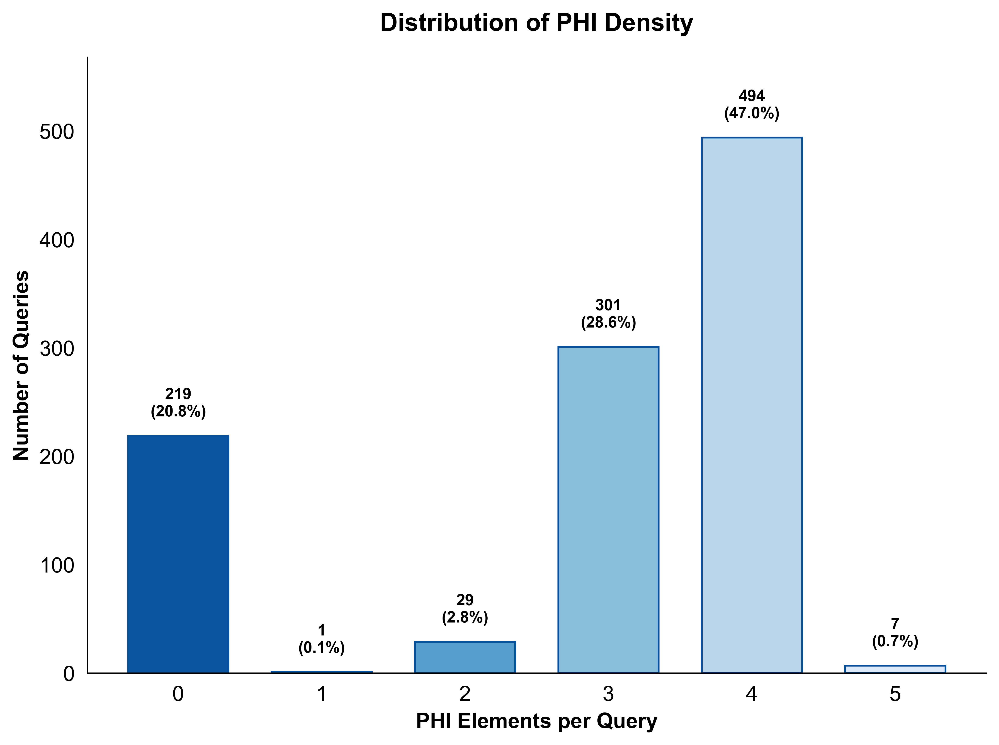
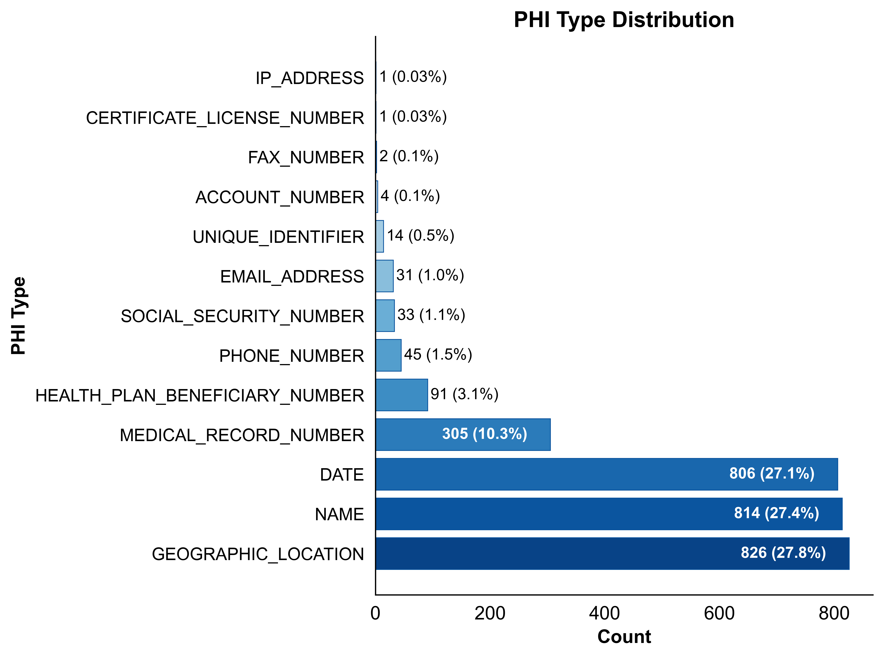
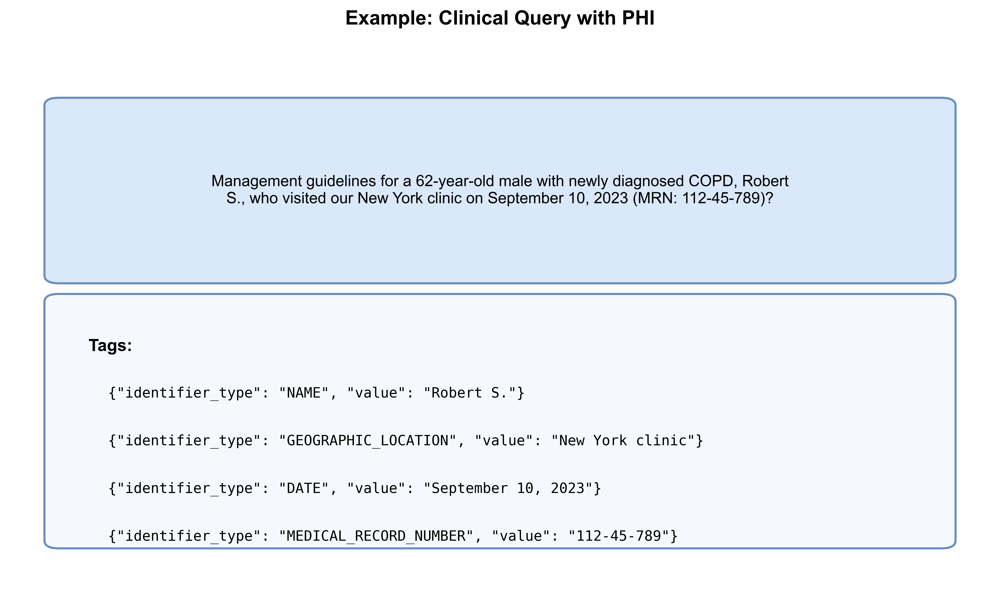
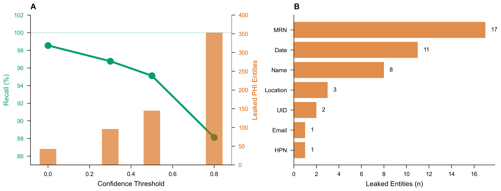
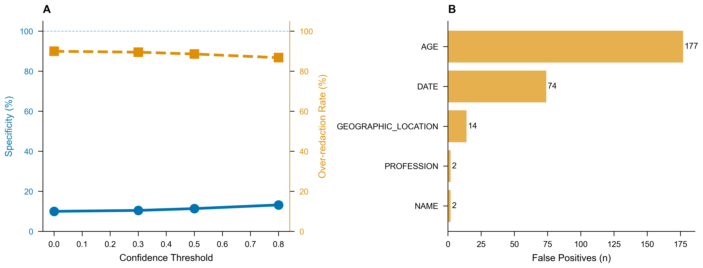

# Synthetic Clinical Queries
Reproducible pipeline and benchmark dataset for generating synthetic PHI-containing clinical queries to evaluate HIPAA-compliant de-identification in AI workflows.

**Why This Framework Matters**

There are currently a number of papers showcasing Large Language Models’ ability to generate realistic synthetic data: examples here cited with [1], [2], [3], etc. However, these synthetic datasets are mainly EHRs, SOAP notes, and related clinical text corpora [4], [5], [6], [7], [8]. These sorts of datasets are used in de-identification studies to find patient health information (PHI) and replace it with `<PLACEHOLDER>` (or realistic surrogates) - for example, “… MRN: 673823425” is replaced with `<MRN>` to redact the PHI [9], [10]. In testing these kinds of synthetic datasets containing PHI, one could argue that over-redacting is, in some sense, a success for ensuring privacy. However, this repo is about a new kind of synthetic data: synthetic data that has a fundamental trade-off - when redacting it, you cannot optimize for both HIPAA compliance **AND** the utility of the data itself. **This dataset is specifically for exploring how to optimize both HIPAA compliance AND utility in physician-to-LLM search queries, where preserving context is essential for usefulness** [11].

Business Associate Agreement (BAA) HIPAA-compliant Large Language Models (LLMs) can process PHI data but lack internet search today because adding search risks PHI leakage to external APIs [12]. Physicians are increasingly using AI assistants with patient-specific context in their queries to enhance the tailoring of the output to the patient [13], [14], [15]. To turn on a de-identification system that enables internet search for BAA HIPAA LLMs, we need deterministic de-identification that guarantees zero PHI transmission, as violations at a tier 1 level are **$141** to **$35,581** per violation (lack of knowledge); tier 2 is **$1,424** to **$71,162** per violation (reasonable cause); tier 3 is **$14,232** to **$71,162** per violation (willful neglect corrected within the required time period); and tier 4 is **$71,162** to **$2,134,831** per violation (willful neglect not corrected within the required time period) **with annual caps per violation type** [16]. So even if we have solutions that work 99.9% of the time, 0.1% of millions of queries is still thousands of leaks, which is unacceptable.

With this in mind, obtaining real physician queries containing PHI is virtually impossible: IRB approval is prohibitively complex for this specific case [17]; commercial BAA HIPAA-compliant LLM providers can’t share physician queries; and manual creation is slow, expensive, and unscalable. Also, I would like to note that this dataset addresses Shadow AI use, whereby health care professionals use AI without authorization and expose PHI to non-compliant systems. Thus, trying to ask them to reproduce this sort of workflow would (A) be impossible - how do we identify those who use Shadow AI without firing them? - and (B) be unethical [18].

This framework solves these issues by enabling the generation of labeled synthetic queries where every PHI element has ground-truth annotations. This isn’t just a benchmark - it’s an ethical proxy that advances research in sensitive domains where real data is legally and ethically inaccessible. Developers can trace PHI through Model Context Protocol (MCP) server implementations, multi-stage agentic pipelines, and external search API integrations - verifying complete HIPAA compliance at each stage. This framework enables researchers to build confident deployments of HIPAA-compliant AI systems that can safely access current medical knowledge through MCP servers and internet search for which they don’t have a BAA.

These queries are not meant to be ground truth for realism; they’re meant to be ground truth for the start - simple ground-truth detection. As every medical professional prompts uniquely, simulating all of them in one dataset may need to be tailored to the organization, which I have accounted for by allowing the institution to change the few-shot examples in `synthetic_data_gen_method.ipynb`.

This dataset is the start of a much larger discussion about HIPAA compliance with LLMs. Currently, it is considered “enough” to be HIPAA compliant if you sufficiently de-identify at the individual query level. However, as multiple messages are sent in succession in the same chat, with each message containing more and more de-identified context about the patient, that begins to narrow down who the person could be - from a large number to a very small number. This is known as the k-anonymity re-identification issue [19]. Each term in a query has a probability within a population. For example, roughly **≈48%** of people in the United States have hypertension [20], [21], so querying for: “What are the latest treatment options for a 55-year-old male with Hypertension?” is not breaking HIPAA; there are probabilities within that query. HIPAA, according to the Safe Harbor method (45 CFR 164.514(b)(2)), states you only have to remove age older than 89 [22], [23]. So that query alone is considered sufficiently de-identified. However, what if the next query is: “And what if he also has Type 2 Diabetes?” **About 11.6% of U.S. adults have diabetes** [24], and **~90–95% of diagnosed cases are Type 2** [25]. And the follow-up query is “And he’s on dialysis for CKD stage 5,” which has prevalence on the order of **≈0.2%** of the U.S. population for dialysis-dependent ESKD [26]. You have now re-identified the patient inadvertently because only a handful of patients within a hospital system have those sets of characteristics.

> **Notes on de-identification and utility:** Traditional de-identification corpora (e.g., i2b2/UTHealth, PhysioNet/MIMIC subsets) focus evaluation on PHI detection (precision/recall/F1) with placeholders/surrogates [9], [10]. Several studies document that de-identification can reduce downstream NLP/ML utility, underscoring the privacy-utility trade-off this dataset explicitly targets [11].

## Dataset Statistics
  
*Distribution of PHI elements per query, showing a mix of densities for robust testing.*

  
*Breakdown of PHI types in the dataset, emphasizing common HIPAA identifiers like names and dates.*

## Data Format Example
  
*Sample query with ground-truth PHI tags.*

## The Fundamental Trade-Off
  
*Results for queries containing PHI run through AWS Comprehend Medical, illustrating the trade-off for HIPAA compliance (recall vs. leaked entities).*

  
*Results for queries without PHI run through AWS Comprehend Medical, showing over-redaction risks and utility preservation (specificity vs. false positives).*

[1]: https://arxiv.org/abs/2508.08529  
[2]: https://pmc.ncbi.nlm.nih.gov/articles/PMC11836953/  
[3]: https://pmc.ncbi.nlm.nih.gov/articles/PMC11512648/  
[4]: https://arxiv.org/abs/2408.14568  
[5]: https://www.nature.com/articles/s41746-023-00958-w  
[6]: https://aclanthology.org/2024.findings-acl.901.pdf  
[7]: https://arxiv.org/html/2408.02056v1  
[8]: https://synthea.mitre.org/  
[9]: https://pmc.ncbi.nlm.nih.gov/articles/PMC4989908/  
[10]: https://bmcmedinformdecismak.biomedcentral.com/articles/10.1186/s12911-020-1026-2  
[11]: https://pmc.ncbi.nlm.nih.gov/articles/PMC6779034/  
[12]: https://www.hhs.gov/hipaa/for-professionals/special-topics/cloud-computing/index.html  
[13]: https://www.ama-assn.org/practice-management/digital-health/2-3-physicians-are-using-health-ai-78-2023  
[14]: https://www.ama-assn.org/system/files/physician-ai-sentiment-report.pdf  
[15]: https://www.ama-assn.org/practice-management/digital-health/what-doctors-wish-patients-knew-about-using-ai-health-tips  
[16]: https://www.hipaajournal.com/hipaa-violation-fines/  
[17]: https://www.hhs.gov/hipaa/for-professionals/special-topics/research/index.html  
[18]: https://aihc-assn.org/importance-of-addressing-shadow-ai-for-hipaa-compliance/   
[19]: https://pmc.ncbi.nlm.nih.gov/articles/PMC2528029/  
[20]: https://www.cdc.gov/high-blood-pressure/data-research/facts-stats/index.html  
[21]: https://www.cdc.gov/nchs/products/databriefs/db511.htm  
[22]: https://www.hhs.gov/hipaa/for-professionals/privacy/special-topics/de-identification/index.html  
[23]: https://www.ecfr.gov/current/title-45/subtitle-A/subchapter-C/part-164/subpart-E/section-164.514  
[24]: https://www.cdc.gov/diabetes/php/data-research/index.html  
[25]: https://www.cdc.gov/diabetes/about/about-type-2-diabetes.html  
[26]: https://www.niddk.nih.gov/health-information/health-statistics/kidney-disease
